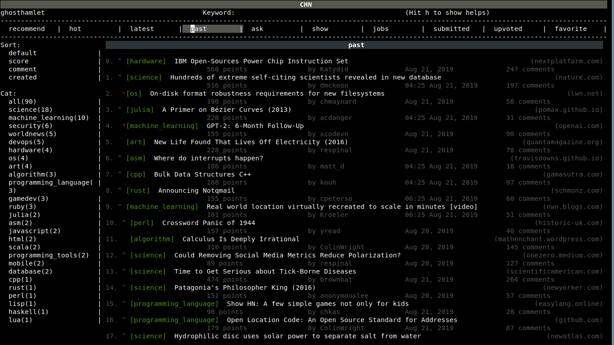

<h1 align="center">Hacker News on Console(CHN)</h1>

A text-based interface (TUI) to view and interact with Hacker News from your Console. 
With auto classifer and recommender with relate to your upvotes and favorites. 
UI code is in reactjs style, easy and familiar for many developer who like reactjs.

## Table of Contents

* [NOTICE](#notice)  
* [Features](#features)  
* [Installation](#installation)  
* [Usage](#usage)  
* [Settings](#settings)
* [TODO](#todo)  
* [Train your own classifer](#train)  
* [License](#license)  

## Notice
CHN tested in Ubuntu in its default terminal, ONLY work with python3.6.7, and maybe python3.6+, macOS/windows and other OS did not tested, BUT when install by Docker see [Installation](#installation), many OS and environments except windows should work.

CHN is still in early stage, may have many bugs and performance problems, but it is already useful now.

Classifer just have around 71% accuracy at present, as it is trained by classify just post titles for 34 categories,
and the data is not so many, has only around 150000 samples, highly imbalanced.
you can train your own classifer, more details about the data/classifer and train method see [Train your own classifer](#train)

## Features
* login to HN and vote/favorite post
* browser all HN list pages include your submitted/voted/favorite page
* use classifer or search to filter different page posts
* auto recommend posts for your interest

create comment/post and view detail did not implement, there are shortcuts to open web browser, they will be implemented and in [TODO](#todo)

## Installation

### By docker

Notice: can't open web browser to show comment/post detail page from docker now, will fix it.

docker run -it --rm --name CHN --volume /srv/CHN/data:/app/data ghosthamlet/chn:latest python ui.py

or use proxy: docker run --net host -it --rm --name CHN --volume /srv/CHN/data:/app/data ghosthamlet/chn:latest python ui.py -p 127.0.0.1:19180

(change 127.0.0.1:19180 to your proxy address)

### By code

git clone https://github.com/ghosthamlet/CHN.git

cd CHN

pip3 install -r requirements.txt

python3 -m spacy download en_core_web_md

## Usage

### By docker
docker run -it --rm --name CHN --volume /srv/CHN/data:/app/data ghosthamlet/chn:latest python ui.py

or use proxy: docker run --net host -it --rm --name CHN --volume /srv/CHN/data:/app/data ghosthamlet/chn:latest python ui.py -p 127.0.0.1:19180

(change 127.0.0.1:19180 to your proxy address)

### By code
python3 ui.py

or use proxy: python3 ui.py -p 127.0.0.1:19180

(change 127.0.0.1:19180 to your proxy address)

### Shortcuts

    h: show/close help screen

    s: goto search keyword, use space to seperate multi keywords

    t: goto select page type, or go back to posts

    v: upvote current post(NOTE: you have to view/load upvoted page first)

    o: favorite current post(NOTE: you have to view/load favorite page first)

    r: refresh posts

    c: open comment page

    enter: open link page

    ctrl c: quit

### Notice

    * when ui frozen, hit t, or ctrl c to quit and restart

    * login is safe, just cookies will save on your computer, 
       accounts will not save, not send to any servers

    * login may FAILED! when you try many times wrong username/password, your ip maybe locked by HN, 
       and it will use google reCAPTCHA to verify your login, you have to wait HN to remove reCAPTCHA to login CHN again

    * use arrows to navigate

    * sometimes after loading new page, ui maybe frozen, hit t to activate it

    * load submitted/upvoted/favorite pages maybe very slow first time if you have many data, 
       but after first load it will be fast
 

## Train
### About the dataset
Training data has around 150000 samples, were collected from reddit.com. 
In the start, there are 110 cats, every cat is a manually selected subreddit, 
all front page and top page posts in the subreddit formed the whole dataset.
It currently just contain posts title, did not crawl the posts body.
The samples for some cats are quite imbalanced.
For more info see in Train.ipynb *Explore data section*.

### About the classifer
I taked the following experiments to select classifer:

<pre>
CATS                CLASSIFER                   ACCURACY           RECALL

110                 LogisticRegression          around 0.55        around 0.55

110                 ComplementNB                around 0.55        around 0.55

110                 SGDClassifier               around 0.55        around 0.55

110                 RandomForestClassifier      not fin            not fin

110                 SVC                         not fin            not fin

110                 SGDClassifier               around 0.55        around 0.55

110                 LinearSVC                   around 0.55        around 0.55

101                 LinearSVC                   0.59               around 0.59

57                  LinearSVC                   0.62               around 0.62

41                  LinearSVC                   0.65               around 0.65

34over_sampling     LinearSVC                   0.73               0.73 (val/test accuracy is 0.63)

34under_sampling    LinearSVC                   under 0.7          under 0.7

34                  LinearSVC                   0.709              0.71
</pre>

* i did not record the experiments history, the ACCURACY/RECALL with around is approximate value, 
 i will redo these with hyperparameter-hunter when i have time
* 'not fin' classifer is too slow on my laptop to fin
* aslo too slow to run random search and cross validation on my laptop, so i did not do it
* 101 and 57 cats are dataset with least and most samples cats removed
* 41 cats are dataset with many sub cats combined to one cat (highly imbalanced)
* 34 cats are dataset removed some too broad cats, and merged some related cats (most highly imbalanced)
* 34over_sampling cats is the same dataset as 34 cats, but added imblearn.over_sampling.SMOTE resample in pipline (most highly imbalanced)
* most classifer val/test accuracy/recall is near the train accuracy/recall, 
  except the classifer with imblearn.over_sampling.SMOTE resample

Some experiments tried in kaggle GPU kernel:

<pre>
CATS                CLASSIFER                                    TRIAN ACCURACY     TEST ACCURACY

34                  LinearSVC with word2vec                       around 0.55        around 0.55

34                  XGBoost                                       not fin            not fin

34                  AWD_LSTM (fine tuning with fastai)            around 0.68        around 0.68

34                  Transformer (fine tuning with fastai)         around 0.60        around 0.60

34                  GPT2+AWD_LSTM (fine tuning with fastai)       not fin            not fin

34                  BERT (fine tuning with pytorch-transformers)  around 0.78        around 0.78
</pre>

* GPT2+AWD_LSTM, GPT2 for generate the posts body from its title, the body generated is good, 
  but did not good enough to closely related to the title subject, so i did not use it,
  in the future when the GPT2001 is so good, maybe it can be used to replace crawling post body for high accuracy
* 34 cats are dataset removed some too broad cats, and merged some related cats (most highly imbalanced)

Overall, i did very little hyperparameter tune for all classifer, from the results, deep transfer learning by fine tuning BERT is the most accurate classifer for this poor dataset, but is very slow, the simple LinearSVC is fast and performance just behind BERT, so i am using it in this project.

### Train your own classifer
1. change reddit crawl settings in config.py, crawl subreddits posts by run crawler.py, you can use exists data/reddit.csv and skip this step
2. train in Train.ipynb, sorry the code in Train notebook is not good
3. change hn_classifer_model in config.py with saved model of the previous step 

## Settings
see config.py

## TODO
* package app by pip or PyInstaller, so user can easy install,
  tried PyInstaller, succ to build executable, but failed to run, 
  the executable started many CHN processes, killed the OS
* use hyperparameter-hunter to manage machine learning experiments
* optimize classifer accuracy by crawl and classify posts body not just
  title, and use deep transfer learning(maybe fine tuning BERT) to classify
* optimize recommender performance by compare posts body, aslo optimize its
  speed, it is rather slow now, maybe remove spacy and use raw word2vec
* optimize app ui performance, add more progress reminder
* updating guest pages will update all data of that page now,
  change it to incremental updates like the user only pages
* optimize react speed, let render just update itself component, not all components
* refactor react api/code to more conform to reactjs, and extract it to independent pip library
* add vim like shortcuts
* add comment/post detail page, search/sort post comments, and create comment/post functions
* add chart/graph page to show cats/keywords of submitted/upvoted/favorite stats along time
* make the latest/hot/recommend page real time

## License
This project is distributed under the [MIT](LICENSE) license.
